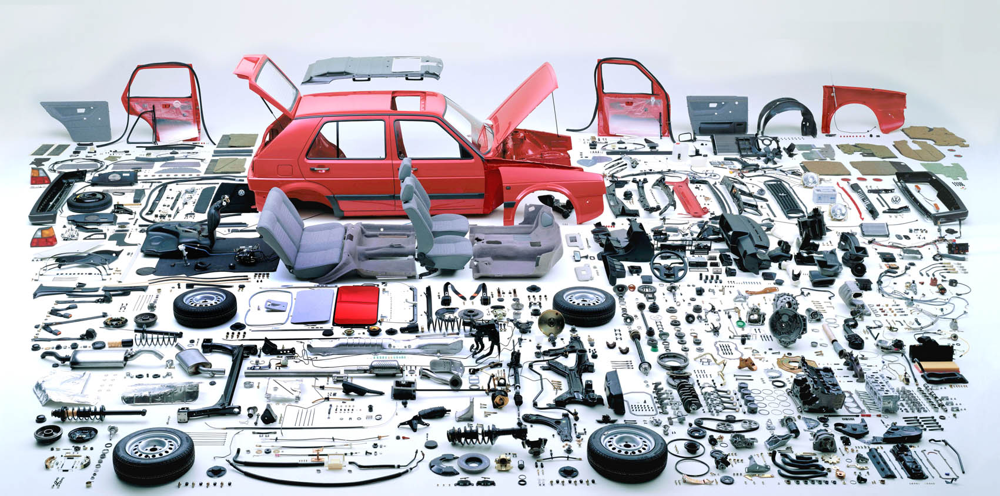

# HPC的复杂，在于架构设计

## 架构设计的目的

聪明的你一定知道，汽车设计，并不是把一流的零部件装在一起，就能造就一台好车，不然还要整车厂干啥呢？比如，要让汽车能达到百公里加速10秒以内，发动机、传动、底盘分别要如何设计？要让汽车做到百公里油耗7L以内，对风阻有什么要求，细化到造型又如何权衡？面临市场竞争，如何压缩零部件成本，该裁剪哪一部分的零部件，而哪些零部件是万万不能动的，否则会出现安全或质量事故？...奥迪和奥拓的差距是大大的，HPC也一样，并不是把软件、硬件买来，组装在一起，就是一台**高性能计算机**的。

高性能计算系统（High Performance Computer，HPC），由软件、硬件、中间件等构成，软件细分又包含调度、权限、门户、中间件...硬件细分，包含服务器、存储、交换机...**HPC天生就是一个复杂系统。**

而对用户来说，需要的是简单而强大的HPC，最好不用看说明书就能上手。就像汽车，考个驾照就应该能开。

复杂和简单的矛盾，是要靠技术来解决的。架构设计，就是把复杂系统简单化的手段。**把复杂问题简单化，既是一门技术，也是一门艺术。

小白工程师如何入行HPC架构设计？心里必然疑问重重，最常遇到的就是下面两个：

>
> * 设计这么复杂的系统，从哪下手？
>
> **从分析需求下手**。通过熟悉和理解需求，识别复杂度的所在，针对这些**复杂点**，进行架构设计。
>
> * A公司用这个，B公司用那个，我们公司该用哪个？
>
> 理解A/B公司架构背后所要解决的**复杂点**，然后对比自己的业务复杂点，参考复杂点相似的方案。
>

所以，架构设计的核心，其实是在识别和搞定**复杂点**上。

那站在**复杂点**的角度，再来看看那些**"外行领导"**提的问题，就不难回答了：

> * 人家一个任务能跑200核，你能不能做到？
>
> 任务跑到200核，说明人家业务成熟。人家的复杂点是要解决多节点并行计算的问题。
>
> * 人家都用上GPU加速了，咱们要不要买点？
>
> 人家用GPU加速，可能是人家的应用支持GPU，而且GPU比CPU计算性价比高。
>
> * 人家用云计算，你也赶快上云！
>
> 人家用云是要解决弹性不足或短期负载削峰的问题，咱有这问题么？
>

总之，架构设计，是为**复杂点**服务的。抓住**复杂点**，就抓住了架构设计的关键。

## 考虑架构设计，从哪里入手？

高性能计算，顾名思义，架构是少不了考虑性能的。那么除了性能，还有什么需要考虑的？其实很多...

> - 可扩展性
> - 高可用
> - 安全性
> - 成本
> - 可靠性
> - ...

