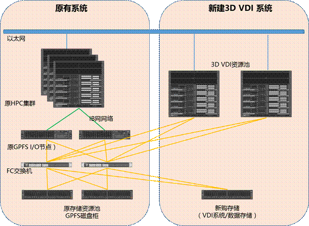
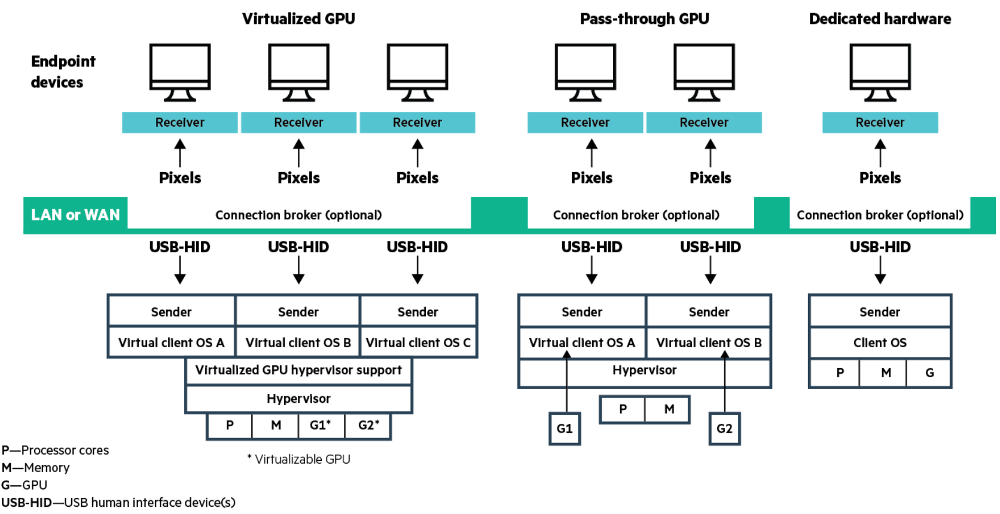

# 远程仿真解决方案

# 远程三维可视化解决方案

### VDI方案（软件、硬件整体方案）

VDI方案是一个包含软件、硬件的整体方案，是通用的解决方案。VDI是基础设施架构的变化，从传统分散的终端图站到集中的服务器资源池的管理。

可以跑任何桌面应用，当然也包括三维可视化的应用。

### 三维可视化应用

传统仿真过程，要在计算全部完成后，通过后处理软件打开计算结果文件，才能看到仿真结果。三维可视化属于工程上的技术。三维可视化技术是CAE软件厂商提供的功能，可使CAE软件在仿真过程中，直接以图形的方式看到软件计算结果，无需把题目算完。三维可视化应用并不挑底层架构，即可以工作在传统工作站上，也可以在VDI方案上运行。

#### 代表性的三维可视化应用

##### Ansys：[Discovery Live](https://blogs.nvidia.cn/2017/09/how-does-ansys-discovery-live-change-design-work/)

discovery live是基于SCDM的，所以启动界面是SCDM的界面。目前支持四个分析类型，结构，模态，热和流场。但都是简单的分析，比如结构没看到支持非线性和动力学，模态可以计算，但不能分析后期的线性动力学，热貌似只支持结构热，流体只能分析简单流动等等。[【知乎】](https://www.zhihu.com/question/67275542)

##### Dassult

.....

## VDI解决方案涉及哪些厂商

单纯的VDI解决方案，主要有两类，一类是底层硬件，一类是中间件。

#### 底层硬件：只有NVIDIA提供方案

Nvdia给合作伙伴（联想，惠普，dell）提供专用的VGPU解决方案，电脑厂商在这个基础上拿出整机。

用GPU软件，需要采购vGPU的License，授权方式有：

- 永久许可
- 按年订阅，可以把固投科目变成费用科目

#### Hypervisor中间件：国际主流是Citrix/Vmware，开源方案成本低廉百花齐放

- Vmware
- Citrix /华为（相当于Citrix）
- 开源KVM：NICE、深信服，中兴、阿里云等。基于开源的KVM方案，各产品的封装大同小异，有针对不同场景各自的特点。因为是开源方案，有成本优势，在国内有一定市场。

#### remote display protocols是什么？

以Citrix方案为例，由多个产品构成，服务器端XenServer，传输端X3D，客户端XenDesktop，是不同的功能模块。负责传输的X3D就是把服务器端渲染的像素，通过RDP协议封装，传输到工程师PC端。

[参考](http://images.nvidia.com/content/pdf/grid/guides/HPE-High-Performance-Remote-Visualization-Solution-Whitepaper.pdf)

常见的协议：

- Citrix：HDX 3D Pro
- VMware： Horizon
- HP： RGS
- NICE： DCV
- [RealVNC](http://www.realvnc.com)
- [TurboVNC and VirtualGL](http://www.virtualgl.org)

#### 有哪些行业共识？

- EC2，阿里的桌面云产品，都是用的Nvdia的底层方案。
- 性能：主流车厂不是Vmware就是Citirx。阿里的中间件采用KVM，性能上不如CV两家。
- 费用：所有方案均包含许可、实施、维护费用
- 带宽和延迟，直接影响使用效果，是中间件的约束。使用流畅，要求千兆内网，干线负载1000Mbps可以支持30-40个并发。
- 不同中间件的协议间Benchmark？可以根据市场接受度给出选型意见，例如市场占有率。

#### 服务器虚拟化/桌面虚拟化，为什么会有这样的说法？

服务器虚拟化和桌面虚拟化的区别主要在于对图形处理能力的要求不同。

服务器虚拟化不需要很高的图形能力，是通过CPU来模拟GPU。对图形要求不高的场景可以胜任，像CAE分析、视频剪辑等对图形要求较高的桌面应用场景，服务器虚拟化就不能支撑了。

Nvdia的vGPU技术出来已经5-6年了，但是发展到4.0以上，才逐渐成熟。2016年起，不少企业也从百兆到桌面升级为千兆到桌面，外部环境逐渐成熟，市场也开始逐渐旺盛，进入了大规模部署的阶段。全国来讲，东南沿海应用得比较早、多，内地2017年才刚刚开始热起来。

#### VDI用于CAE软件还需要考虑什么？

CAE软件要提供对vGPU技术的支持

#### 对虚机的管理功能，是否满足业务需要？

不能，管理功能主要体现在对虚机本身的管理，如配置变化、虚机迁移、虚机性能监控等。

虚机管理并不包括业务场景需要的调度、流程、传输等功能，需要其它软件支持。

#### 为什么要有vGPU License？

各厂商材料中提到的Grid，指的是软件版本。NVDIA希望通过软件功能迭代，提升硬件功能。不用改变硬件，仅升级软件，就可以带来新的功能/特性。软件带来了价值，因此也要收取License费用。

2018年已经发布了5.2，将要发布6.0版本，例如增加热迁移的能力。

#### 图卡是否是专用的？

以往必须采用专门的图卡，才能支持VDI。例如早年的K1/K2卡，目前已经停产了。

随着技术进步，已经不在区别计算GPU和虚拟化GPU了，使用同样的硬件都可以实现对应的功能。

2018年在售产品为：M2000/P系列的P40/P100/V100。Tesla也可以做图形虚拟化。

### 有哪些优秀案例？

国内已经有很多企业做了VDI。

- 汽车：（点=并发用户数）
  - 奇瑞Vmware
  - 一汽Citrix，一期200个点
  - 上汽
  - 通用Vmware
  - 广汽本田，2018年初国内最大，现有800个点
  - 商飞，在上海
  - 一汽，已经开始，上了200个点
  - 中国中车
  - 威马汽车，正在实施
  - 蔚来汽车，计划
  - 车和家，暂无考虑
  - 明德时代，2017年建成，400点。
  - 青岛海尔：Vmware，不太确定：2016年底上了120点，2017年一月的招标。
- 东风小康，重庆较大的，第一期600点，正在招标，计划2018年1季度实施。小康新建了新能源汽车项目，所以用了最新的基础设施架构全新搭建。
- 中冶赛迪
- 广州超算：Enginframe+DCV+Slurm

